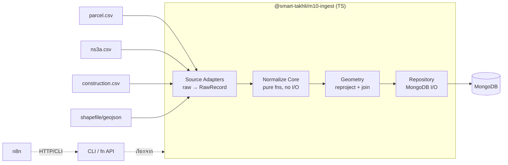

# Spec: Ingestion + Normalize ข้อมูลมาตรา 10 → Canonical Store

**แพ็กเกจ:** `@smart-takhli/m10-ingest` (data layer)
**วันที่:** 2026-06-21 · **สถานะ:** Draft พร้อมเข้า implementation
**บริบท:** Smart Takhli — ระบบปรับปรุงแผนที่ภาษีและทะเบียนทรัพย์สิน เทศบาลเมืองตาคลี

---

## 1. บริบทและขอบเขต

ข้อมูลมาตรา 10 จากกรมที่ดินมาเป็นชุดไฟล์รายเดือน ปัจจุบันเจ้าหน้าที่ต้องคีย์มือเข้า LTAX online (ระบบปิด ไม่มี API) รอบนี้โฟกัส **data layer**: รับชุดไฟล์ → parse → normalize → เก็บลง canonical store ให้สะอาดและเชื่อถือได้ เพื่อเป็นฐานของการ diff/reconcile รอบถัดไป

**In scope**
- Parse 4 inputs ต่อ batch: `parcel.csv`, `ns3a.csv`, `construction.csv`, shapefile/GeoJSON
- Normalize → canonical model (`records`, `transactions`, `import_batches`, `rejects`)
- Reproject geometry → join เข้า record
- Idempotent ingestion + quarantine ของเสีย

**Out of scope (รอบถัดไป)**
- Diff / spatial reconcile (แบ่งแยก/รวมแปลงด้วย geometry)
- Review UI, worklist→LTAX, RPA
- การเทียบกับ LTAX baseline export (รอบ diff)

---

## 2. ลักษณะข้อมูลต้นทาง (ตรวจสอบจากไฟล์จริง ม.ค. 2569)

- **เป็น changelog รายเดือน** — แต่ละแถว = 1 transaction มี `สถานะดำเนินการ` + `วันที่`
- **CRS = EPSG:24047** (Indian 1975 / UTM Zone 47N) พิกัดเป็นเมตร *ยังไม่ใช่ WGS84*
- **Join key = ระวาง + เลขที่ดิน** (geometry ไม่มีเลขโฉนด) — geometry 59 รูป, parcel 87 แถว = **59 แปลง + 28 transaction ซ้ำบนแปลงเดิม** (ทุกแปลงเดือนนี้มีรูปครบ)
- ความสกปรกที่ต้องจัดการ: **trailing space** ในค่าและชื่อคอลัมน์, วันที่ `d/m/yyyy` พ.ศ. ไม่ zero-pad, เงิน `"฿304,000.00"` / `"฿-"` (= ว่าง), `UTM4` ไม่ pad (`7` vs `07`)

---

## 3. สถาปัตยกรรม (Approach A)



- **Adapters** — หน้าที่เดียว: อ่าน 1 source format → `RawRecord` ไม่มี domain logic เพิ่มชนิดเอกสารใหม่ = เพิ่ม adapter
- **Normalize Core** — pure functions ไม่มี I/O, รวม domain logic ทั้งหมด, unit-test ได้เต็ม
- **Geometry** — reproject + spatial join แยกออกมา (พึ่ง proj4)
- **Repository** — แตะ MongoDB เท่านั้น
- แพ็กเป็น standalone TS package: CLI + function API → n8n เรียกได้ แต่ logic ทดสอบแยกจาก n8n

---

## 4. Data model (MongoDB)

```
import_batches            // 1 ต่อชุดไฟล์รายเดือน
  _id, optId, optName, period("2569-01"),
  files[{name, hash}], counts{parcel,ns3a,construction,geometry},
  importedAt, status(processing|done|failed)

transactions              // changelog — เก็บทุกแถว, append-only/immutable
  _id, batchId, docType(PARCEL|NS3A|CONSTRUCTION),
  recordKey, rawStatus("ขาย"...), changeType, taxRelevant:bool,
  txnDate(ISO), regAmount:number|null,
  owner{title,name,surname,idHash}, payloadRaw{...ทั้งแถวเดิม}, createdAt

records                   // ทะเบียนสถานะปัจจุบัน — upsert จาก txn ที่กระทบทะเบียน
  _id, docType, key{ravang,landNumber} | {deedNo} | {ns3aNo}, deedNo,
  area{rai,ngan,wa,sqm}, location{province,amphoe,tambon},
  owners[{title,name,surname,idHash,address}],
  geometry(GeoJSON Polygon, EPSG:4326)|null, hasGeometry:bool,
  status(active|retired), lastTxnId, lastChangeType, version, history[], updatedAt

rejects                   // quarantine — ของที่ normalize/validate ไม่ผ่าน
  _id, batchId, source, rawRow, reason, createdAt
```

**Indexes:** `records.key` (compound), `records.deedNo`, `records.geometry`(2dsphere), `transactions.{batchId,recordKey}`, `import_batches.fileHash`

**ความสัมพันธ์:** `transactions` = log ดิบครบ (รวมจำนอง) · `records` = สถานะปัจจุบันที่ materialize จากเฉพาะ txn ที่ `taxRelevant` กระทบทะเบียน — txn จำนองถูกเก็บแต่ไม่ขยับ records

---

## 5. สถานะ → changeType dictionary (อนุมัติแล้ว)

| changeType | taxRelevant | สถานะดำเนินการ |
|---|:---:|---|
| TRANSFER | ✓ | ขาย · ขายตามคำสั่งศาล · โอนมรดก · ให้ |
| TRANSFER_PARTIAL | ✓ | ให้เฉพาะส่วน (ระหว่างภาระจำยอม) |
| MERGE | ✓ | ไถ่ถอนจากจำนอง รวมสองโฉนด · ลงชื่อคู่สมรส รวมสองโฉนด · ให้ รวมสองโฉนด |
| NEW | ✓ | เอกสารสิทธิที่เกิดใหม่ - ปรับปรุง ระหว่างเดือน |
| SPLIT | ✓ | แบ่งแยกในนามเดิม |
| SPLIT_PUBLIC | ✓ | แบ่งหักเป็นที่สาธารณประโยชน์ |
| BOUNDARY_CHANGE | ✓ | สอบเขตโฉนดที่ดิน |
| OWNER_CORRECTION | ✓ | แก้ชื่อ (ราชการให้เปลี่ยนชื่อ) |
| ENCUMBRANCE | ✗ | จำนอง · ไถ่ถอนจากจำนอง · ขึ้นเงินจากจำนอง · จำนองเพิ่มหลักทรัพย์ · จำนองลำดับที่สอง · ระงับจำนอง (ศาลขายบังคับจำนอง) |
| NOTE | ✗ | หมายเหตุสารบัญ |
| ADMIN | ✗ | ใบแทน |

- `MERGE` ถือ "การรวมโฉนด" เป็นแกนหลัก ส่วน aspect รอง (ไถ่ถอน/ลงชื่อคู่สมรส/ให้) เก็บใน `rawStatus`
- `ns3a` ใช้ map ร่วม + เพิ่ม `เอกสารสิทธิที่ยกเลิกระหว่างเดือน` → `RETIRED` (taxRelevant ✓)
- สถานะที่ไม่อยู่ใน dictionary → **quarantine** ไม่ใช่เดา

---

## 6. Normalize rules (pure functions)

```
trimAll        strip ทุกค่า + ชื่อคอลัมน์ ก่อนประมวลผลเสมอ
area → sqm     (ไร่×400 + งาน×100 + วา + เศษ/10) × 4
                 // เศษ = ส่วนสิบของ ตร.ว. (อิงค่าที่พบเป็นเลขหลักเดียว 0–9)
                 // ⚠ ASSUMPTION: ยืนยันกับระเบียน LTAX จริง 1 รายการก่อน production
owner          fullName = trim(คำนำหน้า + ชื่อ + นามสกุล)
                 idHash = sha256(digitsOnly(เลข13หลัก))   // PDPA: ไม่เก็บเลขดิบ
ravangKey      `${UTM1}|${UTM2}|${UTM3}|${zeroPad(UTM4,2)}|${Scale}`  (+ landNumber)
                 // ใช้ฟังก์ชันเดียวกันทั้งฝั่ง attribute และ geometry
changeType     MAP[ strip(สถานะ) ]  → ไม่เจอ → reject(reason="unknown_status")
date           "d/m/yyyy"(พ.ศ.) → ปี−543 → ISO (รับ d/m ไม่ pad)
currency       "฿1,234.50" → 1234.5 ; "฿-" หรือว่าง → null
```

---

## 7. Geometry

- **Reproject 24047 → 4326 ต้องทำ datum transformation จริง** (proj4 ตั้ง def Indian 1975 + `towgs84`) — ทดสอบแล้ว: ข้าม datum shift = เพี้ยน ~625 ม. **ห้ามใช้ EPSG:32647 แทน**
- เก็บเป็น GeoJSON Polygon (EPSG:4326), แก้ winding order ตาม RFC 7946, validate ด้วย turf
- รองรับ MultiPolygon / หลาย ring (เดือนตัวอย่างเป็น ring เดียว แต่ออกแบบเผื่อ)
- Join เข้า record ด้วย `ravangKey + landNumber` → set `hasGeometry`; ถ้าไม่มี geometry = record ยังถูกต้อง (เช่น ns3a "ไม่บันทึกระวาง")
- `2dsphere` index เตรียมไว้สำหรับ spatial reconcile รอบถัดไป

---

## 8. Error handling / validation

- **Quarantine ไม่ทิ้งเงียบ** — unknown status / area-date parse fail / geometry เสีย / key ไม่ match → เข้า `rejects` พร้อม reason (บทเรียนตรงจากบั๊ก trailing-space: การ drop เงียบคืออันตรายที่สุด)
- **Idempotent** — `import_batches.fileHash` กันนำเข้าซ้ำ; รันไฟล์เดิม = no-op; upsert by key + dedup transaction by `(batchId, recordKey, rawStatus, txnDate)`
- **Fatal vs warning** — คอลัมน์บังคับหาย = fatal (ยกเลิกทั้ง batch, status=failed); แถวเดียวเสีย = warning + quarantine (ไปต่อ)

---

## 9. Testing (เข้า TDD รอบ build)

- Unit test `normalize/*` ด้วย **แถวจริงจากไฟล์ตัวอย่าง** เป็น fixtures
- **Completeness test:** ทุก `สถานะ` ใน fixtures ต้อง map ได้ (assert no reject reason="unknown_status") — จับบั๊กแบบ trailing-space อัตโนมัติ
- **Reproject golden test:** จุดตัวอย่าง E=647023,N=1683144 → lat∈[15.20,15.25], lon∈[100.36,100.37]
- **Join test:** sample → 59/59 matched, 0 unmatched
- **Idempotency test:** import batch เดียวกัน 2 ครั้ง → state เท่ากัน

---

## 10. Validated assumptions (พิสูจน์กับข้อมูลจริงแล้ว)

| สมมติฐาน | ผล |
|---|---|
| ต้องทำ datum shift 24047→4326 | ✓ ข้าม = เพี้ยน 625 ม.; แปลงถูก = ตกที่ตาคลี |
| join ด้วย ระวาง(zero-pad)+เลขที่ดิน | ✓ 59/59 matched |
| สถานะ map ครบ | ✓ 21/21 (หลัง strip); taxRelevant 66/87, กรอง 24% |

---

## 11. Open items

- ⚠ **หน่วย `เศษ`** — ยืนยันว่าเป็นส่วนสิบของ ตร.ว. กับระเบียน LTAX จริง 1 รายการ
- **LTAX baseline export schema** — เก็บไว้สำหรับรอบ diff (ยังไม่ใช้รอบนี้)
- map ของ `ns3a` / `construction` สถานะเต็มชุด (ตัวอย่างมีน้อย — เก็บ unknown เข้า quarantine ไปก่อน)

---

## 12. รอบถัดไป

diff/spatial reconcile (SPLIT/MERGE ด้วย geometry overlap + confidence) → Review UI บนแผนที่ → worklist→LTAX / RPA
