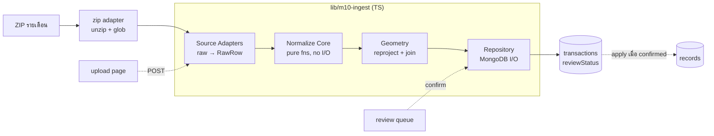

# Spec: Ingestion + Normalize ข้อมูลมาตรา 10 → Canonical Store

**แพ็กเกจ:** `lib/m10-ingest` (data layer ในโมดูล convention ของ repo — ไม่ใช่ npm workspace แยก)
**วันที่:** 2026-06-21 · **แก้ไข:** 2026-06-22 (rev.2 — ยืนยันกับ ZIP จริง + เพิ่ม §2.1/§13) · **สถานะ:** พร้อมเข้า implementation
**บริบท:** Smart Takhli — ระบบปรับปรุงแผนที่ภาษีและทะเบียนทรัพย์สิน เทศบาลเมืองตาคลี

---

## 1. บริบทและขอบเขต

ข้อมูลมาตรา 10 จากกรมที่ดินมาเป็นชุดไฟล์รายเดือน ปัจจุบันเจ้าหน้าที่ต้องคีย์มือเข้า LTAX online (ระบบปิด ไม่มี API) รอบนี้โฟกัส **data layer**: รับชุดไฟล์ → parse → normalize → เก็บลง canonical store ให้สะอาดและเชื่อถือได้ เพื่อเป็นฐานของการ diff/reconcile รอบถัดไป

**In scope**
- รับ **ZIP รายเดือน** จากหน้า upload (admin) → แตก → parse 4 inputs ต่อ batch: `parcel_*.csv`, `ns3a_*.csv`, `construction_*.csv`, geometry GeoJSON (`*_MAP_LAND_GIS_*.geojson`)
- Normalize → canonical model (`records`, `transactions`, `import_batches`, `rejects`)
- Reproject geometry (24047→4326, in-batch) → แนบเข้า transaction → join 59/59
- Idempotent ingestion + quarantine ของเสีย
- Shadow DB (`records`) แสดงกรรมสิทธิ์ปัจจุบัน + as-of materialization (ดู ณ 1 ม.ค.)
- คิวยืนยันโดยคน (human-in-the-loop) ก่อน apply เข้า `records`
- 3 admin surfaces: upload · คิวยืนยัน · records viewer (as-of) — ดู §13

**Out of scope (รอบถัดไป)**
- Diff / spatial reconcile (แบ่งแยก/รวมแปลงด้วย geometry)
- **การ link/match เข้า basemap `public/parcel.shp.geojson`** — รอบนี้ geometry มาจากในซิป (ดู §2.1); การจับคู่ม10→basemap (เลขโฉนด 43/59, 16 ตัวที่เหลือคือของใหม่/แบ่งแยก/รวม) คืองาน reconcile
- Map Review UI, worklist→LTAX, RPA
- การเทียบกับ LTAX baseline export (รอบ diff)

---

## 2. ลักษณะข้อมูลต้นทาง (ตรวจสอบจากไฟล์จริง ม.ค. 2569)

- **เป็น changelog รายเดือน** — แต่ละแถว = 1 transaction มี `สถานะดำเนินการ` + `วันที่`
- **CRS = EPSG:24047** (Indian 1975 / UTM Zone 47N) พิกัดเป็นเมตร *ยังไม่ใช่ WGS84*
- **Join key = ระวาง + เลขที่ดิน** (geometry ไม่มีเลขโฉนด) — geometry 59 รูป, parcel 87 แถว = **59 แปลง + 28 transaction ซ้ำบนแปลงเดิม** (ทุกแปลงเดือนนี้มีรูปครบ)
- ความสกปรกที่ต้องจัดการ: **trailing space** ในค่าและชื่อคอลัมน์, วันที่ `d/m/yyyy` พ.ศ. ไม่ zero-pad, เงิน `"฿304,000.00"` / `"฿-"` (= ว่าง), `UTM4` ไม่ pad (`7` vs `07`)

---

## 2.1 Ground truth จาก ZIP จริง (`60070001_60010000.zip`, ม.ค. 2569)

ไฟล์มาเป็น ZIP เดียวต่อเดือน ข้างในมีโฟลเดอร์ `<optId>/` (ชื่อเปลี่ยนทุกเดือน → หาด้วย glob ไม่ hardcode):

```
parcel_<id>.csv          87 แถว  — โฉนดที่ดิน (changelog)
ns3a_<id>.csv             4 แถว  — น.ส.3ก (schema ต่าง)
construction_<id>.csv    12 แถว  — สิ่งปลูกสร้าง (ไม่มี key แปลง)
<id>_MAP_LAND_GIS_47.geojson    59 features, EPSG:24047 — geometry (ใช้ตัวนี้)
<id>_MAP_LAND_GIS_47.{shp,dbf,shx,prj,cpg}  — shapefile (ข้าม, อ่าน geojson พอ)
parcel_<id>.csv_ogr_tmp.csv · *.pdf          — ขยะ (ข้าม)
```

**Field map ของจริง** (แทนชื่อที่เคยเดา):

| field | parcel.csv | geometry geojson | ns3a.csv |
|---|---|---|---|
| ระวาง | `UTM_MAP1..4` + `UTM_SCALE` | `LandUTM1..4` + `LandUTMScale` | `UTM_AIRMAP1..3` + `UTM_SCALE` |
| เลขที่ดิน | `ที่ดิน` | `LandNumber` | `ล.ที่ดิน` |
| เลขโฉนด | `โฉนด` (เก็บไว้รอบ reconcile) | — (ไม่มี) | `เลขที่นส3ก` |
| สถานะ | `สถานะดำเนินการ` | — | `สถานะ` |
| เงิน | `REG_AMT` (มี space + `฿-`) | — | `REG_AMT` |
| เจ้าของ | `คำนำหน้า/ชื่อ/นามสกุล` + `13 หลัก` | — | เหมือน parcel |
| เนื้อที่ | `ไร่/งาน/วา/เศษ` | — | `ไร่/งาน/วา /เศษ` |

- geometry ห่อใน `{"LocationGeospatial": { ...FeatureCollection... }}` → adapter ต้อง **unwrap** ก่อน; `crs.properties.name = "EPSG:24047"`
- **construction** ไม่มี key แปลงที่ดิน/ระวาง → เก็บเป็น transaction อย่างเดียว ไม่ materialize record
- ค่า numeric ใน geometry props เป็น number จริง (`LandUTM2:2`, `LandUTMScale:1000`) ส่วน CSV เป็น string → ต้อง coerce+trim ก่อนสร้าง key

**ยืนยันด้วยข้อมูลจริง (rev.2):**
- in-batch join ระวาง(pad)+เลขที่ดิน: parcel 87 แถว → **59 key unique**, geometry 59 → **matched 59/59, unmatched 0**
- parcel มี 21 distinct สถานะ — exact-match dictionary 20/21; เหลือ **"ขึ้นเงินจากจำนอง ครั้งที่หนึ่ง"** ที่ dictionary เดิมเขียนแค่ "ขึ้นเงินจากจำนอง" → ต้องเติม variant (ดู §5)

---

## 3. สถาปัตยกรรม (Approach A)



- **Adapters** — หน้าที่เดียว: อ่าน 1 source format → `RawRow` ไม่มี domain logic; `zip.ts` แตกซิป+glob, แต่ละ doctype = 1 adapter
- **Normalize Core** — pure functions ไม่มี I/O, รวม domain logic ทั้งหมด, unit-test ได้เต็ม
- **Geometry** — reproject (datum shift) + join แยกออกมา (พึ่ง proj4 + turf)
- **Repository** — แตะ MongoDB เท่านั้น (รวม confirm/reject/apply/as-of)
- วางใน `lib/m10-ingest/` ตาม module convention ของ repo (models ที่ `models/m10-ingest/`); เรียกผ่าน function API จาก API route / CLI (`scripts/m10-ingest.js`) → n8n เรียกได้ logic ทดสอบแยก
- **Test runner: Vitest** (ตัวแรกของ repo) · geometry deps: `proj4` + `@turf/turf` · ZIP: `adm-zip` · upload multipart: `formidable` (มีแล้ว)

---

## 4. Data model (MongoDB)

```
import_batches            // 1 ต่อชุดไฟล์รายเดือน
  _id, optId, optName, period("2569-01"),
  files[{name, hash}], counts{parcel,ns3a,construction,geometry},
  importedAt, status(processing|done|failed)

transactions              // changelog — เก็บทุกแถว, append-only/immutable
  _id, batchId, docType(PARCEL|NS3A|CONSTRUCTION),
  recordKey, deedNo,        // deedNo จาก `โฉนด` — เก็บไว้รอบ reconcile (ไม่ใช้ join รอบนี้)
  rawStatus("ขาย"...), changeType, taxRelevant:bool,
  txnDate(ISO),            // = effective date → ใช้ทำ as-of materialization
  regAmount:number|null, reviewStatus(pending|confirmed|rejected|auto),
  owner{title,name,surname,idHash}, area{rai,ngan,wa,sqm}|null,
  geometry(GeoJSON Polygon, EPSG:4326)|null,  // batch fact: reprojected geom ของ parcel txn (join 59/59 ตอน ingest); copy ขึ้น record ตอน apply
  payloadRaw{...ทั้งแถวเดิม}, createdAt

records                   // ทะเบียนสถานะปัจจุบัน — upsert จาก txn ที่กระทบทะเบียน
  _id, docType, key{ravang,landNumber} | {deedNo} | {ns3aNo}, deedNo,
  area{rai,ngan,wa,sqm}, location{province,amphoe,tambon},
  owners[{title,name,surname,idHash,address}],
  geometry(GeoJSON Polygon, EPSG:4326)|null, hasGeometry:bool,
  status(active|retired), lastTxnId, lastChangeType, version, history[], updatedAt

rejects                   // quarantine — ของที่ normalize/validate ไม่ผ่าน
  _id, batchId, source, rawRow, reason, createdAt
```

**Collections/models:** prefix กัน collision ใน Mongo ที่แชร์ข้าม sibling apps — collections `m10_*` (`m10_import_batches`/`m10_transactions`/`m10_records`/`m10_rejects`), models `M10*`

**Indexes:** `records.recordKey` (unique), `records.deedNo`, `records.geometry`(2dsphere, sparse), `transactions.{batchId,recordKey,rawStatus,txnDate}`(unique, dedup), `transactions.reviewStatus`, `import_batches.fileHash`

**ความสัมพันธ์:** `transactions` = log ดิบครบ (รวมจำนอง) · `records` = สถานะที่ materialize จากเฉพาะ txn ที่ `taxRelevant && reviewStatus=confirmed` — txn จำนอง/note/admin เก็บไว้แต่ไม่ขยับ records

---

## 4.1 Temporal model · as-of · คิวยืนยัน

**Shadow DB (ไม่เป็นทางการ):** `records` คือฐานจำลองที่แยกขาดจาก LTAX ใช้ "ดู/เตรียม" กรรมสิทธิ์ปัจจุบัน — *ไม่ใช่ฐานภาษีทางการ* การปรับจริงทำในหน้าต่างที่ระเบียบอนุญาต (ตาม requirement: หลัง ก.ย.)

**Effective dating:** `txnDate` = วันที่มีผลของแต่ละ transaction → ใช้ replay ตามเวลาได้

**Apply logic (txn → records):**
- เรียง txn ตาม `txnDate`
- apply เฉพาะ `taxRelevant && reviewStatus=confirmed && มี recordKey` เข้า `records` (เพิ่ม version, ดัน snapshot เดิมเข้า history)
- **construction** = ไม่มี recordKey (ไม่มีระวาง) → ถึงจะ taxRelevant ก็ไม่ materialize record (เก็บเป็น transaction log อย่างเดียว); reviewStatus = `auto`
- ENCUMBRANCE / NOTE / ADMIN → `reviewStatus=auto`, เก็บใน transactions เฉยๆ ไม่ขยับ records

**as-of(cutoff):** materialize สถานะ ณ วันใดก็ได้ โดยใช้ txn ที่ `txnDate ≤ cutoff` → ระบบให้ 2 มุมที่ต่างกัน:
- **current** = ผู้ถือครองปัจจุบัน (งานปฏิบัติ)
- **as-of 1 ม.ค.** = ผู้ถือครองที่ใช้กำหนดภาษีปีนั้น (= ชุดที่จะ generate ส่ง LTAX ตอนเปิดหน้าต่าง)
- การเปลี่ยนแปลง *หลัง* 1 ม.ค. ไม่กระทบผู้เสียภาษีปีนั้น แต่ติดอยู่ใน current สำหรับปีถัดไป

**คิวยืนยันโดยคน:** txn ที่กระทบกรรมสิทธิ์/เนื้อที่ (TRANSFER\* / MERGE / SPLIT\* / NEW / RETIRED / BOUNDARY_CHANGE / OWNER_CORRECTION) เริ่มที่ `reviewStatus=pending` → เจ้าหน้าที่ confirm/reject → confirmed เท่านั้นจึง apply เข้า `records` (รอบนี้เป็น list ธรรมดา; Review UI บนแผนที่ไว้รอบ reconcile)

---

## 5. สถานะ → changeType dictionary (อนุมัติแล้ว)

| changeType | taxRelevant | สถานะดำเนินการ |
|---|:---:|---|
| TRANSFER | ✓ | ขาย · ขายตามคำสั่งศาล · โอนมรดก · ให้ |
| TRANSFER_PARTIAL | ✓ | ให้เฉพาะส่วน (ระหว่างภาระจำยอม) |
| MERGE | ✓ | ไถ่ถอนจากจำนอง รวมสองโฉนด · ลงชื่อคู่สมรส รวมสองโฉนด · ให้ รวมสองโฉนด |
| NEW | ✓ | เอกสารสิทธิที่เกิดใหม่ - ปรับปรุง ระหว่างเดือน |
| SPLIT | ✓ | แบ่งแยกในนามเดิม |
| SPLIT_PUBLIC | ✓ | แบ่งหักเป็นที่สาธารณประโยชน์ |
| BOUNDARY_CHANGE | ✓ | สอบเขตโฉนดที่ดิน |
| OWNER_CORRECTION | ✓ | แก้ชื่อ (ราชการให้เปลี่ยนชื่อ) |
| ENCUMBRANCE | ✗ | จำนอง · ไถ่ถอนจากจำนอง · ขึ้นเงินจากจำนอง **ครั้งที่หนึ่ง/สอง/...** · จำนองเพิ่มหลักทรัพย์ · จำนองลำดับที่สอง · ระงับจำนอง (ศาลขายบังคับจำนอง) |
| NOTE | ✗ | หมายเหตุสารบัญ |
| ADMIN | ✗ | ใบแทน |

- `MERGE` ถือ "การรวมโฉนด" เป็นแกนหลัก ส่วน aspect รอง (ไถ่ถอน/ลงชื่อคู่สมรส/ให้) เก็บใน `rawStatus`
- `ns3a` ใช้ map ร่วม + เพิ่ม `เอกสารสิทธิที่ยกเลิกระหว่างเดือน` → `RETIRED` (taxRelevant ✓)
- **variant "ครั้งที่..."** (rev.2): ของจริงเป็น `ขึ้นเงินจากจำนอง ครั้งที่หนึ่ง` — เติม entry variant ที่เจอจริงเข้า dictionary ตรง ๆ (ไม่ใช้ regex เดา); ตัวที่ยังไม่เคยเห็น → quarantine ตามเดิม
- สถานะที่ไม่อยู่ใน dictionary → **quarantine** ไม่ใช่เดา · `reviewStatus` เริ่มต้น: changeType ที่กระทบกรรมสิทธิ์/เนื้อที่ → `pending`; ENCUMBRANCE/NOTE/ADMIN → `auto` (ดู §4.1)

---

## 6. Normalize rules (pure functions)

```
trimAll        strip ทุกค่า + ชื่อคอลัมน์ ก่อนประมวลผลเสมอ
area → sqm     (ไร่×400 + งาน×100 + วา + เศษ/10) × 4
                 // เศษ = ส่วนสิบของ ตร.ว. (อิงค่าที่พบเป็นเลขหลักเดียว 0–9)
                 // ⚠ ASSUMPTION: ยืนยันกับระเบียน LTAX จริง 1 รายการก่อน production
owner          fullName = trim(คำนำหน้า + ชื่อ + นามสกุล)
                 idHash = sha256(digitsOnly(เลข13หลัก))   // PDPA: ไม่เก็บเลขดิบ
ravangKey      `${UTM1}|${UTM2}|${UTM3}|${zeroPad(UTM4,2)}|${Scale}`  (+ landNumber)
                 // ใช้ฟังก์ชันเดียวกันทั้งฝั่ง attribute และ geometry
changeType     MAP[ strip(สถานะ) ]  → ไม่เจอ → reject(reason="unknown_status")
date           "d/m/yyyy"(พ.ศ.) → ปี−543 → ISO (รับ d/m ไม่ pad)
currency       "฿1,234.50" → 1234.5 ; "฿-" หรือว่าง → null
```

---

## 7. Geometry

- **อ่าน geojson ที่ห่อใน `LocationGeospatial`** (unwrap → `.features`); props ใช้ `LandUTM1..4` + `LandUTMScale` + `LandNumber` สร้าง `recordKey` ด้วย**ฟังก์ชันเดียวกับฝั่ง attribute** (coerce number→string + pad UTM4)
- **Reproject 24047 → 4326 ต้องทำ datum transformation จริง** (proj4 def Indian 1975 + `towgs84`) — ทดสอบแล้ว: ข้าม datum shift = เพี้ยน ~625 ม. **ห้ามใช้ EPSG:32647 แทน**
- เก็บเป็น GeoJSON Polygon (EPSG:4326), แก้ winding order ตาม RFC 7946, validate ด้วย turf
- รองรับ MultiPolygon / หลาย ring (เดือนตัวอย่างเป็น ring เดียว แต่ออกแบบเผื่อ)
- **Join in-batch** ด้วย `ravangKey + landNumber` → แนบ geometry ไว้กับ parcel transaction (`transactions.geometry`); ตอน confirm→apply จึง copy ขึ้น record + set `hasGeometry`; ไม่มี geometry = record ยังถูกต้อง (เช่น ns3a/construction)
- geometry ที่ join ไม่ติด → quarantine (`reason="geometry_unmatched"`); geometry เสีย/invalid → `reason="geometry_invalid"`
- `2dsphere` index (sparse) เตรียมไว้สำหรับ spatial reconcile รอบถัดไป
- **basemap `public/parcel.shp.geojson` ไม่เกี่ยวรอบนี้** — เป็น WGS84 อยู่แล้ว ไม่มีระวาง (mapsheet 3/13436); การจับคู่ม10→basemap = งาน reconcile (ดู Out of scope)

---

## 8. Error handling / validation

- **Quarantine ไม่ทิ้งเงียบ** — unknown status / area-date parse fail / geometry เสีย / key ไม่ match → เข้า `rejects` พร้อม reason (บทเรียนตรงจากบั๊ก trailing-space: การ drop เงียบคืออันตรายที่สุด)
- **Idempotent** — `import_batches.fileHash` กันนำเข้าซ้ำ; รันไฟล์เดิม = no-op; upsert by key + dedup transaction by `(batchId, recordKey, rawStatus, txnDate)`
- **Fatal vs warning** — คอลัมน์บังคับหาย = fatal (ยกเลิกทั้ง batch, status=failed); แถวเดียวเสีย = warning + quarantine (ไปต่อ)

---

## 9. Testing (เข้า TDD รอบ build)

- Unit test `normalize/*` ด้วย **แถวจริงจากไฟล์ตัวอย่าง** เป็น fixtures
- **Completeness test:** ทุก `สถานะ` ใน fixtures ต้อง map ได้ (assert no reject reason="unknown_status") — จับบั๊กแบบ trailing-space อัตโนมัติ
- **Reproject golden test:** จุดตัวอย่าง E=647023,N=1683144 → lat∈[15.20,15.25], lon∈[100.36,100.37]
- **Join test:** sample → 59/59 matched, 0 unmatched (ใช้ field จริง `UTM_MAP*`↔`LandUTM*`)
- **Idempotency test:** import batch เดียวกัน 2 ครั้ง → state เท่ากัน
- **Review/apply test:** ingest → records ว่าง (ทุก ownership txn = pending); confirm 1 ตัว → record เกิด + version/history; reject → ไม่ขยับ
- **as-of test:** confirm txn 2 ใบต่างวัน → `asOf(วันแรก)` เห็นเฉพาะใบแรก, `asOf(วันหลัง)` เห็นทั้งคู่
- **ZIP adapter test:** ใส่ ZIP ตัวอย่าง → glob เจอครบ 4 ชนิด, unwrap geojson ได้, ข้ามไฟล์ขยะ

---

## 10. Validated assumptions (พิสูจน์กับข้อมูลจริงแล้ว)

| สมมติฐาน | ผล |
|---|---|
| ต้องทำ datum shift 24047→4326 | ✓ ข้าม = เพี้ยน 625 ม.; แปลงถูก = ตกที่ตาคลี |
| join ด้วย ระวาง(zero-pad)+เลขที่ดิน | ✓ 59/59 matched (rev.2 ยืนยันด้วย field จริง `UTM_MAP*`↔`LandUTM*`) |
| สถานะ map ครบ | ⚠ 20/21 exact; 1 ตัว (`ขึ้นเงินจากจำนอง ครั้งที่หนึ่ง`) ต้องเติม variant แล้วจึง 21/21 |
| ม10 มีเลขโฉนด (`โฉนด`) | ✓ มี — แต่ join เข้า basemap ได้ 43/59 (16 = ของใหม่) → เลื่อนไป reconcile |

---

## 11. Open items

- ⚠ **หน่วย `เศษ`** — ยืนยันว่าเป็นส่วนสิบของ ตร.ว. กับระเบียน LTAX จริง 1 รายการ
- **LTAX baseline export schema** — เก็บไว้สำหรับรอบ diff (ยังไม่ใช้รอบนี้)
- map ของ `ns3a` / `construction` สถานะเต็มชุด (ตัวอย่างมีน้อย — เก็บ unknown เข้า quarantine ไปก่อน)

---

## 12. รอบถัดไป

diff/spatial reconcile (SPLIT/MERGE ด้วย geometry overlap + confidence) → Review UI บนแผนที่ → worklist→LTAX / RPA · จับคู่ม10→basemap (`public/parcel.shp.geojson`)

---

## 13. Admin surfaces (rev.2)

3 หน้า admin — แต่ละหน้าลงทะเบียนสิทธิ์ครบ 4 จุดตาม skill `adding-admin-page` (ALL_PAGES · DEFAULT_PERMISSIONS · LayoutAdmin nav · migration script) และ re-verify สิทธิ์ฝั่ง server แบบ `requirePm25Admin`:

| หน้า | API | หน้าที่ |
|---|---|---|
| `/admin/m10-ingest` | `POST /api/m10-ingest/upload` (formidable multipart + adm-zip) | อัปโหลด ZIP → `ingest()` แบบ synchronous → การ์ดสรุป (period, counts: txn/record/reject/geometry matched) + ตาราง reject (source, reason, แถวดิบ); ซิปเดิม → `{skipped:true}` แสดง "เดือนนี้นำเข้าแล้ว" |
| `/admin/m10-review` | `GET /api/m10-ingest/transactions?reviewStatus=pending` · `POST /api/m10-ingest/transactions/[id]/confirm\|reject` | คิวยืนยัน (list ธรรมดา) → confirm ⇒ `applyTxnToRecord`; reject ⇒ แค่เปลี่ยน reviewStatus |
| `/admin/m10-records` | `GET /api/m10-ingest/records?asOf=YYYY-MM-DD` | viewer: เลือก cutoff (current / 1 ม.ค. / custom) → `asOfMaterialize(cutoff)` แสดงรายการ records ณ เวลานั้น |

- **ไม่เก็บไฟล์ ZIP ดิบ** — เก็บแค่ `fileHash` ใน `import_batches` เพื่อ idempotency (ลด PDPA surface)
- API ทั้งหมดอยู่ใต้ `pages/api/m10-ingest/*` (Clerk-guarded, ไม่ใช่ cron); function API `lib/m10-ingest/ingest.ts` เรียกซ้ำได้จาก CLI/n8n
- auth pattern: lookup Mongo user → match `appId` → เช็ค `allowedPages` → superadmin ลัด (ดู `pages/api/pm25/_auth.js`)
